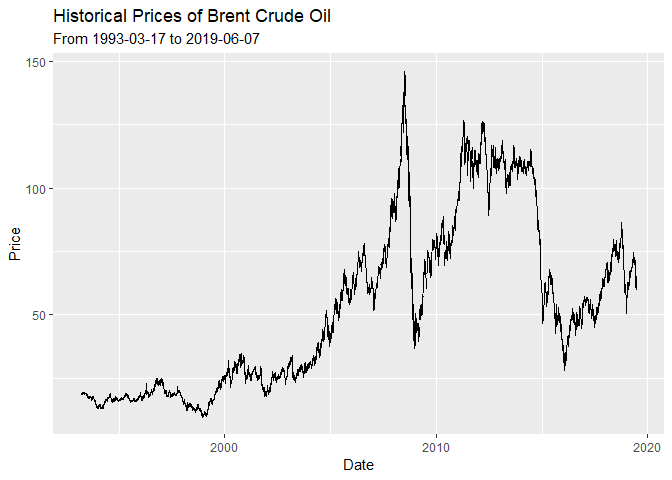
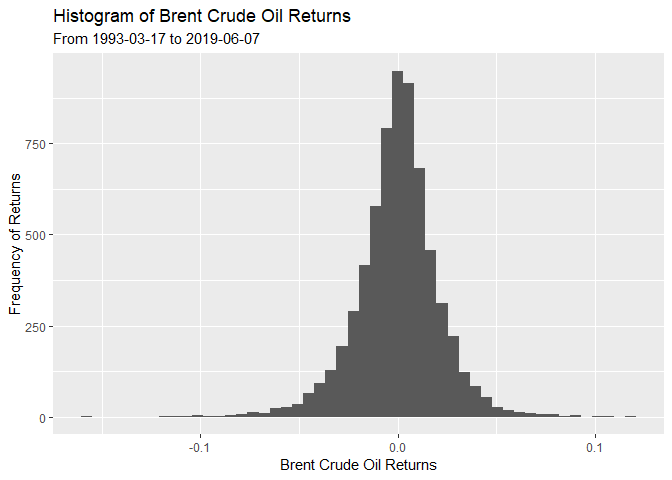
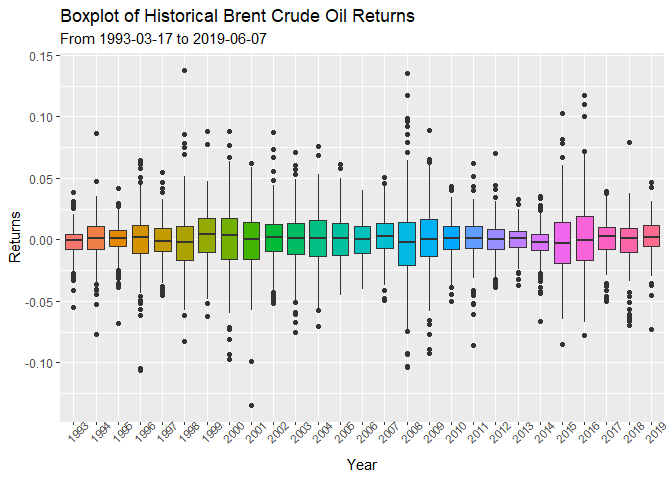
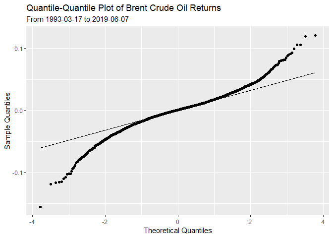
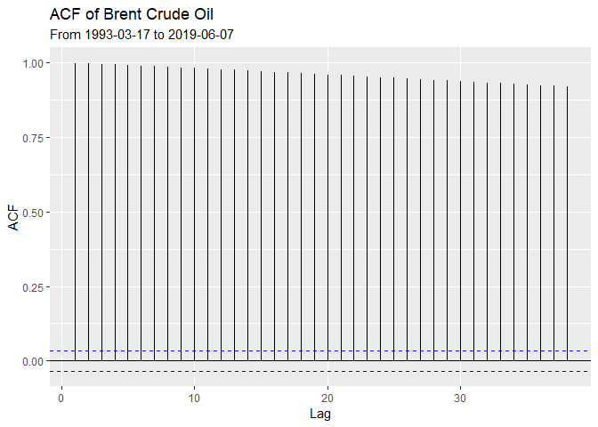
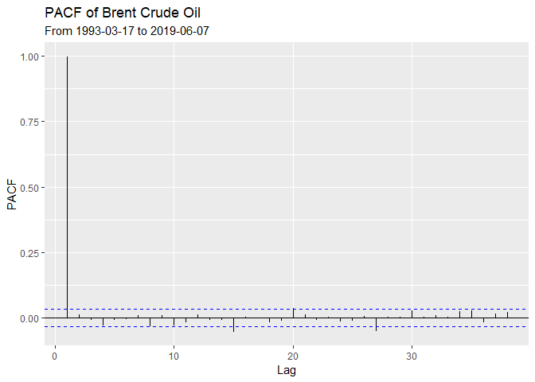
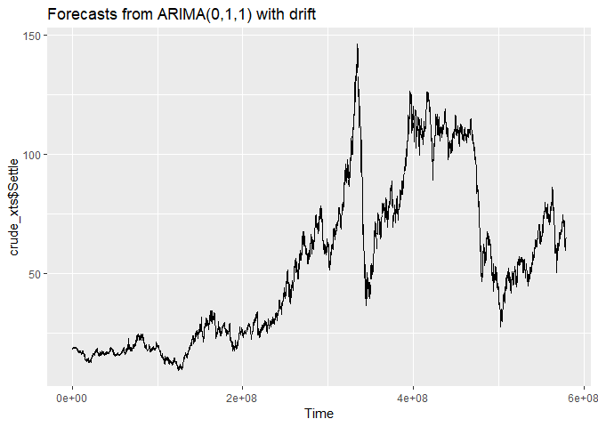
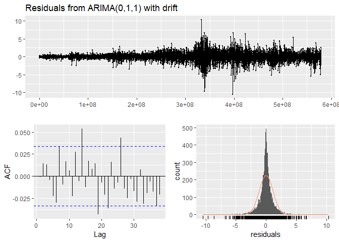
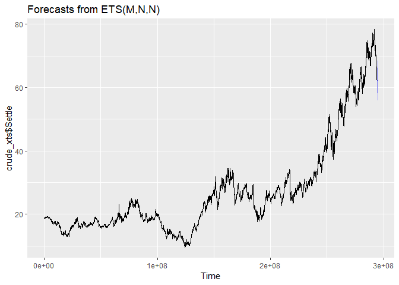
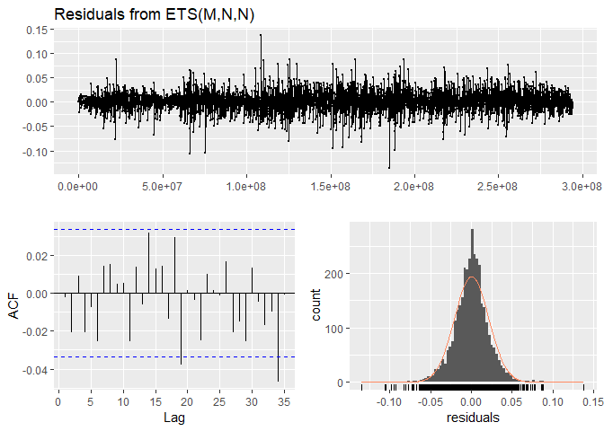

Forecasting Energy Prices with R
================

The following project involves the implementation of simple forecasting
techniques in R within the context of energy and commodity prices. It
leverages on [Quandl’s API for Continuous
Futures](https://www.quandl.com/data/CHRIS-Wiki-Continuous-Futures),
data manipulation functions from [dplyr](https://dplyr.tidyverse.org/)
and time series methods from [forecast by Rob
Hyndman](https://www.rdocumentation.org/packages/forecast/versions/8.7).

### 1\. Library Imports and Preprocessing

``` r
# Import key libraries
library(knitr)
library(tidyverse)
```

    ## Registered S3 methods overwritten by 'ggplot2':
    ##   method         from 
    ##   [.quosures     rlang
    ##   c.quosures     rlang
    ##   print.quosures rlang

    ## -- Attaching packages ------------------------------------------------------------------------------- tidyverse 1.2.1 --

    ## v ggplot2 3.1.1     v purrr   0.3.2
    ## v tibble  2.1.1     v dplyr   0.8.1
    ## v tidyr   0.8.3     v stringr 1.4.0
    ## v readr   1.3.1     v forcats 0.4.0

    ## -- Conflicts ---------------------------------------------------------------------------------- tidyverse_conflicts() --
    ## x dplyr::filter() masks stats::filter()
    ## x dplyr::lag()    masks stats::lag()

``` r
library(Quandl)
```

    ## Loading required package: xts

    ## Loading required package: zoo

    ## 
    ## Attaching package: 'zoo'

    ## The following objects are masked from 'package:base':
    ## 
    ##     as.Date, as.Date.numeric

    ## Registered S3 method overwritten by 'xts':
    ##   method     from
    ##   as.zoo.xts zoo

    ## 
    ## Attaching package: 'xts'

    ## The following objects are masked from 'package:dplyr':
    ## 
    ##     first, last

``` r
# Query ICE Brent Contract prices from Quandl
crude <- read_csv("https://www.quandl.com/api/v3/datasets/CHRIS/ICE_B1.csv?api_key=rn2xyN_hG9XfxN_9ibFJ"
)
```

    ## Parsed with column specification:
    ## cols(
    ##   Date = col_date(format = ""),
    ##   Open = col_double(),
    ##   High = col_double(),
    ##   Low = col_double(),
    ##   Settle = col_double(),
    ##   Change = col_double(),
    ##   Wave = col_double(),
    ##   Volume = col_double(),
    ##   `Prev. Day Open Interest` = col_double(),
    ##   `EFP Volume` = col_double(),
    ##   `EFS Volume` = col_double(),
    ##   `Block Volume` = col_double()
    ## )

``` r
# View  the structure crude data.frame
str(crude)
```

    ## Classes 'spec_tbl_df', 'tbl_df', 'tbl' and 'data.frame': 6701 obs. of  12 variables:
    ##  $ Date                   : Date, format: "2019-06-24" "2019-06-21" ...
    ##  $ Open                   : num  65.5 64.9 62.5 62.4 60.9 ...
    ##  $ High                   : num  65.8 65.8 64.8 62.5 62.8 ...
    ##  $ Low                    : num  64.1 64 62.4 61.4 60.2 ...
    ##  $ Settle                 : num  64.9 65.2 64.5 61.8 62.1 ...
    ##  $ Change                 : num  -0.34 0.75 2.63 -0.32 1.2 -1.07 0.7 1.34 -2.32 0 ...
    ##  $ Wave                   : num  64.9 65 63.9 62 61.5 ...
    ##  $ Volume                 : num  208520 250898 379061 304110 319584 ...
    ##  $ Prev. Day Open Interest: num  209933 246019 280325 305898 327240 ...
    ##  $ EFP Volume             : num  4800 600 600 12454 2627 ...
    ##  $ EFS Volume             : num  NA NA NA NA NA NA NA NA NA NA ...
    ##  $ Block Volume           : num  4123 6420 14504 3493 5489 ...
    ##  - attr(*, "spec")=
    ##   .. cols(
    ##   ..   Date = col_date(format = ""),
    ##   ..   Open = col_double(),
    ##   ..   High = col_double(),
    ##   ..   Low = col_double(),
    ##   ..   Settle = col_double(),
    ##   ..   Change = col_double(),
    ##   ..   Wave = col_double(),
    ##   ..   Volume = col_double(),
    ##   ..   `Prev. Day Open Interest` = col_double(),
    ##   ..   `EFP Volume` = col_double(),
    ##   ..   `EFS Volume` = col_double(),
    ##   ..   `Block Volume` = col_double()
    ##   .. )

``` r
# View the first few rows of the crude data.frame
head(crude)
```

    ## # A tibble: 6 x 12
    ##   Date        Open  High   Low Settle Change  Wave Volume `Prev. Day Open~
    ##   <date>     <dbl> <dbl> <dbl>  <dbl>  <dbl> <dbl>  <dbl>            <dbl>
    ## 1 2019-06-24  65.5  65.8  64.1   64.9  -0.34  64.9 208520           209933
    ## 2 2019-06-21  64.9  65.8  64     65.2   0.75  65.0 250898           246019
    ## 3 2019-06-20  62.4  64.8  62.4   64.4   2.63  63.9 379061           280325
    ## 4 2019-06-19  62.4  62.6  61.4   61.8  -0.32  62.0 304110           305898
    ## 5 2019-06-18  60.9  62.8  60.2   62.1   1.2   61.5 319584           327240
    ## 6 2019-06-17  62.1  62.4  60.7   60.9  -1.07  61.6 232944           331594
    ## # ... with 3 more variables: `EFP Volume` <dbl>, `EFS Volume` <dbl>,
    ## #   `Block Volume` <dbl>

``` r
# View the last few rows of the crude data.frame
tail(crude)
```

    ## # A tibble: 6 x 12
    ##   Date        Open  High   Low Settle Change  Wave Volume `Prev. Day Open~
    ##   <date>     <dbl> <dbl> <dbl>  <dbl>  <dbl> <dbl>  <dbl>            <dbl>
    ## 1 1993-03-24  18.8  18.8  18.8   18.8     NA    NA      0                0
    ## 2 1993-03-23  18.6  18.6  18.6   18.6     NA    NA      0                0
    ## 3 1993-03-22  18.5  18.5  18.5   18.5     NA    NA      0                0
    ## 4 1993-03-19  18.9  18.9  18.9   18.9     NA    NA      0                0
    ## 5 1993-03-18  18.9  18.9  18.9   18.9     NA    NA      0                0
    ## 6 1993-03-17  18.8  18.8  18.8   18.8     NA    NA      0                0
    ## # ... with 3 more variables: `EFP Volume` <dbl>, `EFS Volume` <dbl>,
    ## #   `Block Volume` <dbl>

``` r
# Convert the crude data.frame to an xts object
crude_xts <- xts(crude[,-1], order.by = as.POSIXct(crude$Date))

head(crude_xts)
```

    ##                      Open  High   Low Settle Change Wave Volume
    ## 1993-03-17 08:00:00 18.80 18.80 18.80  18.80     NA   NA      0
    ## 1993-03-18 08:00:00 18.87 18.87 18.87  18.87     NA   NA      0
    ## 1993-03-19 08:00:00 18.89 18.89 18.89  18.89     NA   NA      0
    ## 1993-03-22 08:00:00 18.50 18.50 18.50  18.50     NA   NA      0
    ## 1993-03-23 08:00:00 18.61 18.61 18.61  18.61     NA   NA      0
    ## 1993-03-24 08:00:00 18.75 18.75 18.75  18.75     NA   NA      0
    ##                     Prev. Day Open Interest EFP Volume EFS Volume
    ## 1993-03-17 08:00:00                       0         NA         NA
    ## 1993-03-18 08:00:00                       0         NA         NA
    ## 1993-03-19 08:00:00                       0         NA         NA
    ## 1993-03-22 08:00:00                       0         NA         NA
    ## 1993-03-23 08:00:00                       0         NA         NA
    ## 1993-03-24 08:00:00                       0         NA         NA
    ##                     Block Volume
    ## 1993-03-17 08:00:00           NA
    ## 1993-03-18 08:00:00           NA
    ## 1993-03-19 08:00:00           NA
    ## 1993-03-22 08:00:00           NA
    ## 1993-03-23 08:00:00           NA
    ## 1993-03-24 08:00:00           NA

### 2\. Time Series Plot of Historical Prices

``` r
# Plot a time series of Brent Crude Oil prices
autoplot(crude_xts$Settle) +
  labs(title = "Historical Prices of Brent Crude Oil", subtitle = "From 1993-03-17 to 2019-06-07") +
  xlab("Date") +
  ylab("Price")
```

<!-- -->
A simple line plot of Brent’s historical prices showcases some salient
historical facts: crude’s extreme rally and decline around the 2008-2009
GFC, the bear market in early 2016, as well as the a high degree of
volatility in late 2018.

### 3\. Histogram of Brent Crude Returns

``` r
# Generate a series of returns with diff()
crude_returns <- diff(crude_xts) / crude_xts[-length(crude_xts)]
head(crude_returns)
```

    ##                             Open         High          Low       Settle
    ## 1993-03-17 08:00:00           NA           NA           NA           NA
    ## 1993-03-18 08:00:00  0.003709592  0.003709592  0.003709592  0.003709592
    ## 1993-03-19 08:00:00  0.001058761  0.001058761  0.001058761  0.001058761
    ## 1993-03-22 08:00:00 -0.021081081 -0.021081081 -0.021081081 -0.021081081
    ## 1993-03-23 08:00:00  0.005910801  0.005910801  0.005910801  0.005910801
    ## 1993-03-24 08:00:00  0.007466667  0.007466667  0.007466667  0.007466667
    ##                     Change Wave Volume Prev. Day Open Interest EFP Volume
    ## 1993-03-17 08:00:00     NA   NA     NA                      NA         NA
    ## 1993-03-18 08:00:00     NA   NA    NaN                     NaN         NA
    ## 1993-03-19 08:00:00     NA   NA    NaN                     NaN         NA
    ## 1993-03-22 08:00:00     NA   NA    NaN                     NaN         NA
    ## 1993-03-23 08:00:00     NA   NA    NaN                     NaN         NA
    ## 1993-03-24 08:00:00     NA   NA    NaN                     NaN         NA
    ##                     EFS Volume Block Volume
    ## 1993-03-17 08:00:00         NA           NA
    ## 1993-03-18 08:00:00         NA           NA
    ## 1993-03-19 08:00:00         NA           NA
    ## 1993-03-22 08:00:00         NA           NA
    ## 1993-03-23 08:00:00         NA           NA
    ## 1993-03-24 08:00:00         NA           NA

``` r
# Plot a Histogram of Returns
ggplot(data = crude_returns, mapping = aes(x = Settle)) +
  geom_histogram(bins = 50) +
  labs(title = "Histogram of Brent Crude Oil Returns", subtitle = "From 1993-03-17 to 2019-06-07") +
  xlab("Brent Crude Oil Returns") +
  ylab("Frequency of Returns")
```

    ## Warning: Removed 123 rows containing non-finite values (stat_bin).

<!-- -->

An analysis of the histogram of returns shows that Brent returns are
mildly left-skewed with a few extreme days where prices rose or fell by
more than 10%.

### 4\. Boxplot Returns By Year

``` r
# Group by Year and Plot a series of Boxplots
crude %>% 
  mutate(year = format(Date, "%Y"), returns = (Settle / lead(Settle) - 1)) %>% 
  group_by(year) %>% 
  ggplot(mapping = aes(x = year, y = returns, fill = year)) +
  geom_boxplot() +
  labs(title = "Boxplot of Historical Brent Crude Oil Returns", subtitle = "From 1993-03-17 to 2019-06-07") +
  xlab("Year") +
  ylab("Returns") +
  theme(legend.position = "none", axis.text.x = element_text(angle = 45, size = 8))
```

    ## Warning: Removed 123 rows containing non-finite values (stat_boxplot).

<!-- -->

By grouping boxplots by years, we can observe changes in volatility over
time. We can observe, for instance, excess volatility in years 2008
(GFC) and 2016 (bear market to \~$20 per barrel). Some of Brent’s
largest moves also occured in the year 2008 as demonstrated by the
extreme outliers.

### 5\. QQ Plot of Returns

``` r
# Plot a QQ PLot of Returns
crude_returns %>% 
  ggplot(mapping = aes(sample = Settle)) +
  stat_qq() +
  stat_qq_line() +
  labs(title = "Quantile-Quantile Plot of Brent Crude Oil Returns", subtitle = "From 1993-03-17 to 2019-06-07") +
  xlab("Theoretical Quantiles") +
  ylab("Sample Quantiles")
```

    ## Warning: Removed 123 rows containing non-finite values (stat_qq).

    ## Warning: Removed 123 rows containing non-finite values (stat_qq_line).

<!-- -->

A QQ Plot tests for the normality of the distribution. The plot above
indicates that Brent price action shows signs of “fat tails” i.e. a
larger-than-expected number of occurrences at the ends of the
distributions. In other words, Brent prices experience extreme moves
that conform more to a Pareto/Cauchy distribution rather than a normal
one.

### 6\. ACF and PACF Analysis

``` r
library(forecast)
```

    ## Registered S3 method overwritten by 'quantmod':
    ##   method            from
    ##   as.zoo.data.frame zoo

    ## Registered S3 methods overwritten by 'forecast':
    ##   method             from    
    ##   fitted.fracdiff    fracdiff
    ##   residuals.fracdiff fracdiff

``` r
# Plot the ACF function of Brent Crude Oil with ggAcf
ggAcf(crude_xts$Settle) +
  labs(title = "ACF of Brent Crude Oil", subtitle = "From 1993-03-17 to 2019-06-07")
```

<!-- -->

``` r
# Plot the PACF function of Brent Crude Oil with ggPacf
ggPacf(crude_xts$Settle) +
  labs(title = "PACF of Brent Crude Oil", subtitle = "From 1993-03-17 to 2019-06-07")
```

<!-- -->

Analysis of the ACF and PACF functions shows high correlation between
Brent prices and lagged values. This suggests the presence of trends in
oil markets, which partially explains the popularity of
“trend-following” amongst commodity traders. The PACF chart suggests
that the autocorrelation is greatly diminished after accounting for
intermediate lags.

### 7\. ARIMA Modeling with Brent Crude Oil Series

``` r
# Fit an ARIMA model to the time series with auto.arima()
arima_fit <- auto.arima(crude_xts$Settle)

# Plot the forecasted prices of Brent Crude from the ARIMA model
arima_fit %>% 
  forecast() %>% 
  autoplot()
```

<!-- -->

Using the auto.arima() functionality in the ‘forecast’ package, R
proposes an ARIMA(0, 1, 1) model for Brent. Predictions for the next-h
default values suggests further declines in the Brent market.

### 8\. Assessing the ARIMA Model

``` r
# Generate a summary of the ARIMA model
summary(arima_fit)
```

    ## Series: crude_xts$Settle 
    ## ARIMA(0,1,1) with drift 
    ## 
    ## Coefficients:
    ##           ma1   drift
    ##       -0.0433  0.0069
    ## s.e.   0.0125  0.0134
    ## 
    ## sigma^2 estimated as 1.297:  log likelihood=-10333.2
    ## AIC=20672.4   AICc=20672.41   BIC=20692.83
    ## 
    ## Training set error measures:
    ##                        ME     RMSE       MAE         MPE     MAPE
    ## Training set 0.0003033823 1.143891 0.7467263 -0.02581701 1.517918
    ##                    MASE         ACF1
    ## Training set 0.01413991 -0.003711283

``` r
# Analyse the residuals of the ARIMA model
checkresiduals(arima_fit)
```

<!-- -->

    ## 
    ##  Ljung-Box test
    ## 
    ## data:  Residuals from ARIMA(0,1,1) with drift
    ## Q* = 24.56, df = 8, p-value = 0.001845
    ## 
    ## Model df: 2.   Total lags used: 10

``` r
# Print the accuracy of the ARIMA model
accuracy(arima_fit)
```

    ##                        ME     RMSE       MAE         MPE     MAPE
    ## Training set 0.0003033823 1.143891 0.7467263 -0.02581701 1.517918
    ##                    MASE         ACF1
    ## Training set 0.01413991 -0.003711283

### 9\. ETS Modeling with Brent Crude Oil Prices

``` r
# Fit an 'Error, Trend, Seasonality' model to Brent Crude Oil time series
ets_fit <- ets(crude_xts$Settle)
```

    ## Warning in ets(crude_xts$Settle): Missing values encountered. Using longest
    ## contiguous portion of time series

``` r
# Plot forecasts made by the ETS model
ets_fit %>% 
  forecast() %>% 
  autoplot()
```

<!-- -->

Again, using the ets() functionality in ‘forecast’, the suggested ETS
model by R proposes a sharper decline in crude markets.

### 10\. Assessing the ETS Model

``` r
# Print a summary of the ETS Model
summary(ets_fit)
```

    ## ETS(M,N,N) 
    ## 
    ## Call:
    ##  ets(y = crude_xts$Settle) 
    ## 
    ##   Smoothing parameters:
    ##     alpha = 0.9697 
    ## 
    ##   Initial states:
    ##     l = 18.7976 
    ## 
    ##   sigma:  0.021
    ## 
    ##      AIC     AICc      BIC 
    ## 23085.60 23085.61 23104.00 
    ## 
    ## Training set error measures:
    ##                      ME      RMSE       MAE        MPE     MAPE       MASE
    ## Training set 0.01316426 0.6194889 0.4218587 0.01342911 1.549775 0.01551558
    ##                     ACF1
    ## Training set -0.01425187

``` r
# Analyse the residuals of the ETS Model
checkresiduals(ets_fit)
```

<!-- -->

    ## 
    ##  Ljung-Box test
    ## 
    ## data:  Residuals from ETS(M,N,N)
    ## Q* = 7.3492, df = 8, p-value = 0.4995
    ## 
    ## Model df: 2.   Total lags used: 10

``` r
# Prin the accuracy of the ETS model
accuracy(ets_fit)
```

    ##                      ME      RMSE       MAE        MPE     MAPE       MASE
    ## Training set 0.01316426 0.6194889 0.4218587 0.01342911 1.549775 0.01551558
    ##                     ACF1
    ## Training set -0.01425187

``` r
# Export the analysis to an R Script
purl("energy-forecasting-in-r.Rmd")
```

    ## 
    ## 
    ## processing file: energy-forecasting-in-r.Rmd

    ## 
      |                                                                       
      |                                                                 |   0%
      |                                                                       
      |..                                                               |   3%
      |                                                                       
      |....                                                             |   7%
      |                                                                       
      |.......                                                          |  10%
      |                                                                       
      |.........                                                        |  14%
      |                                                                       
      |...........                                                      |  17%
      |                                                                       
      |.............                                                    |  21%
      |                                                                       
      |................                                                 |  24%
      |                                                                       
      |..................                                               |  28%
      |                                                                       
      |....................                                             |  31%
      |                                                                       
      |......................                                           |  34%
      |                                                                       
      |.........................                                        |  38%
      |                                                                       
      |...........................                                      |  41%
      |                                                                       
      |.............................                                    |  45%
      |                                                                       
      |...............................                                  |  48%
      |                                                                       
      |..................................                               |  52%
      |                                                                       
      |....................................                             |  55%
      |                                                                       
      |......................................                           |  59%
      |                                                                       
      |........................................                         |  62%
      |                                                                       
      |...........................................                      |  66%
      |                                                                       
      |.............................................                    |  69%
      |                                                                       
      |...............................................                  |  72%
      |                                                                       
      |.................................................                |  76%
      |                                                                       
      |....................................................             |  79%
      |                                                                       
      |......................................................           |  83%
      |                                                                       
      |........................................................         |  86%
      |                                                                       
      |..........................................................       |  90%
      |                                                                       
      |.............................................................    |  93%
      |                                                                       
      |...............................................................  |  97%
      |                                                                       
      |.................................................................| 100%

    ## output file: energy-forecasting-in-r.R

    ## [1] "energy-forecasting-in-r.R"

### 11\. Conclusions

A quick analysis of accuracy terms for each model suggests that the ETS
fit performs slightly better (RMSE of 0.62 versus RMSE of 1.1 for the
ARIMA model).

In both cases, however, simple forecasting based on past values proposes
a continuation of the decline in Brent markets. As of 9th June 2019,
this forecast is supported by macro factors such as a decline in demand
owing to the US-China Trade War, in addition to [a build-up of crude
inventories following news of the 2018 Iranian
Sanctions](https://www.fxstreet.com/news/eia-eia-commercial-crude-oil-inventories-increased-by-68-million-barrels-from-previous-week-201906051430),
as well as [the debottlenecking of the Permian
Basin](https://seekingalpha.com/article/4268482-oil-production-keeps-rising-u-s-gulf-mexico).
